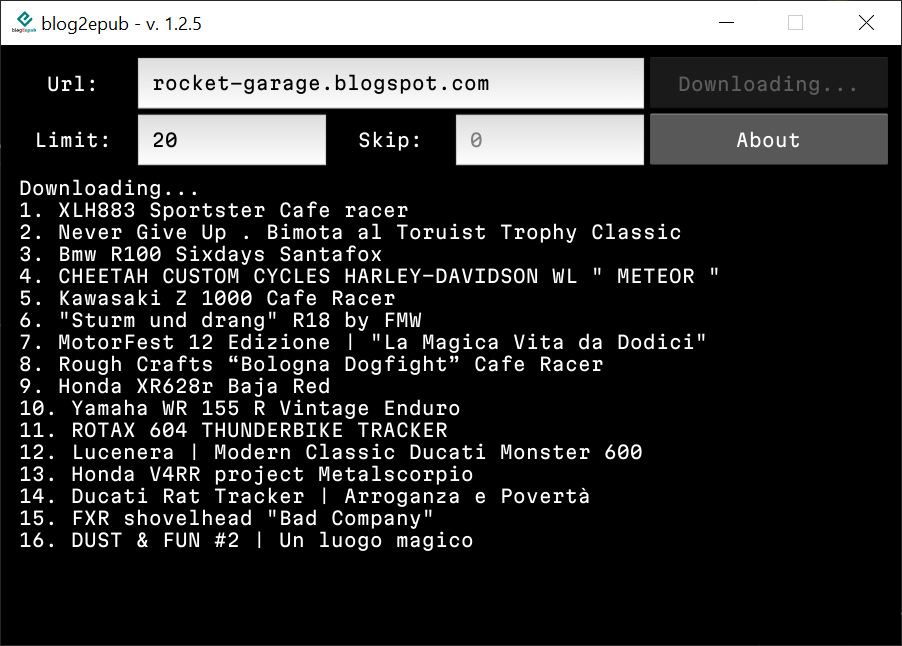
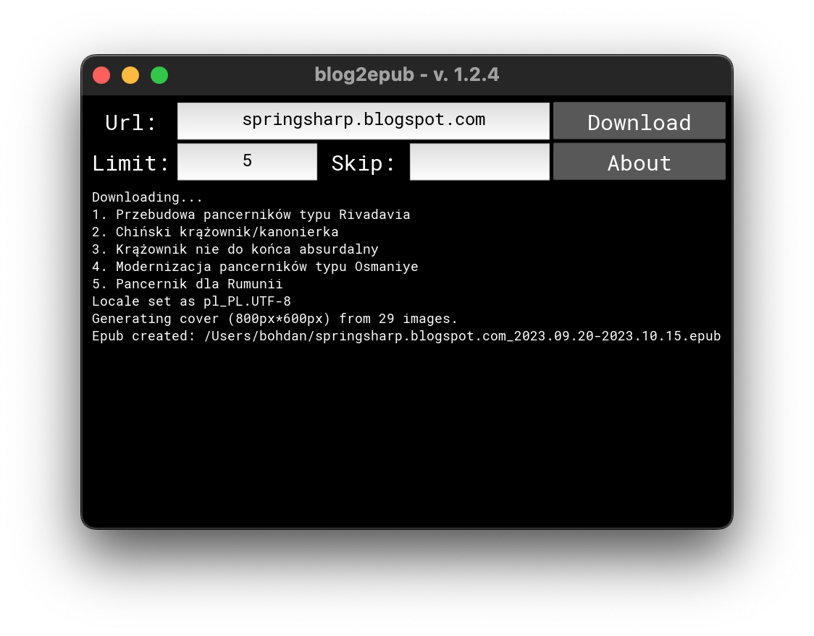

# blog2epub

 

Convert blog to epub using command line or GUI.

### Supported blogs:
- *.wordpress.com and some blogs based on WordPress
- *.blogspot.com

### Main features

- command line (CLI) and graphic user interface (GUI)
- script downloads all text contents of selected blog to epub file,
- if it's possible, it includes post comments,
- images are downsized (to maximum 800/600px) and converted to grayscale,
- one post = one epub chapter,
- chapters are sorted by date ascending,
- cover is generated automatically from downloaded images.

### Example covers

<table style="width:100%;text-align:center;"><tr><td>

</td><td>

</td></tr><tr><td>

</td><td>

</td></tr></table>

## Installation

- for Windows and macOS users: available [builds](https://github.com/bohdanbobrowski/blog2epub/releases)
- python3 setup.py install

### Running froum sources

    git clone git@github.com:bohdanbobrowski/blog2epub.git
    cd blog2epub
    python -m venv venv
    source ./venv/bin/activate
    pip install -r ./requirements.txt
    ./blog2epubgui.py

## Screenshots of GUI

### Windows 10

### macOS

### Linux

## CLI

    blog2epub [blog url] <parameters>

### Parameters

    -l/--limit=[x] - limit epub file to x posts
    -s/--skip=[x] - skip x latest posts
    -q/--images-quality=[0-100] - included images quality (default is 40)
    -n/--no-images - don't include images

## Examples

    blog2epub starybezpiek.blogspot.com
    blog2epub velosov.blogspot.com -l=10
    blog2epub poznanskiehistorie.blogspot.com -q=100
    blog2epub classicameras.blogspot.com --limit=10 --no-images

## Planned features and known bugs

- [ ] code needs some refactor: classes are too "nested" within each other
- [ ] there are some bugs in wordpress.com crawler
- [ ] Linux app/package(s)
- [ ] mobile app (but rather only Android)

## Release notes

### [1.2.5](#in-development)
- [x] utilize GitHub Pages for this project documentation
- [x] save url textfield history and allow easily choose from these urls
- [x] change font from Lato (nice but large files) to much smaller ([Alegreya](https://github.com/huertatipografica/Alegreya) and [Martian Mono](https://github.com/evilmartians/mono) for UI)
- [x] make program window not resizable
- [x] add popup similar to about dialog after finished ebook generation

### [1.2.4](https://github.com/bohdanbobrowski/blog2epub/releases/tag/v1.2.4)
- [x] article loop fix (crawler was reading by default from atomfeed, and returning maximum 25 articles)
- [x] refactor, as usual
- [x] url history saved into yaml file

### [1.2.3](https://github.com/bohdanbobrowski/blog2epub/releases/tag/v1.2.3)
- [x] Windows and macOS (unsigned) builds
- [x] fixed encoding error in month name
- [x] some minor refactors and fixes

### [1.2.2](https://github.com/bohdanbobrowski/blog2epub/releases/tag/v1.2.2)
- [x] Empty images list bug
- [x] Fixing macOS build (works on my machine - Ventura 13.3.1)
- [x] Improving macOS build - dmg now contains Applications folder shortcut to ease installation

### [1.2.1](https://github.com/bohdanbobrowski/blog2epub/releases/tag/v1.2.1)
- [x] Kivy threading fix
- [x] skip parameter fix
- [x] Linux build (now I'm working on adding package to various linux package repositories)

### [1.2.0](https://github.com/bohdanbobrowski/blog2epub/releases/tag/v1.2.0)
- [x] migration to Kivy :-)
- [x] some bugfixes in crawler
- [x] wordpress.com support!

### [1.1.0](https://github.com/bohdanbobrowski/blog2epub/releases/tag/v1.1.0)
- [x] migration to Gtk (for better support on multiple platforms)
- [x] requirements cleanup
- [x] about dialog
- [x] macOS dmg installer included

### [1.0.5](https://github.com/bohdanbobrowski/blog2epub/releases/tag/v1.0.5)
- [x] gzip html in cache folder
- [x] atom feed parsing
- [x] better system notifications, also under linux

### [1.0.4](https://github.com/bohdanbobrowski/blog2epub/releases/tag/v1.0.4)
- [x] improved saving GUI settings
- [x] system notification on finished download

### [1.0.3](https://github.com/bohdanbobrowski/blog2epub/releases/tag/v1.0.3)

- [x] saving GUI settings to yaml file
- [x] first macOS builds (pyinstaller)
