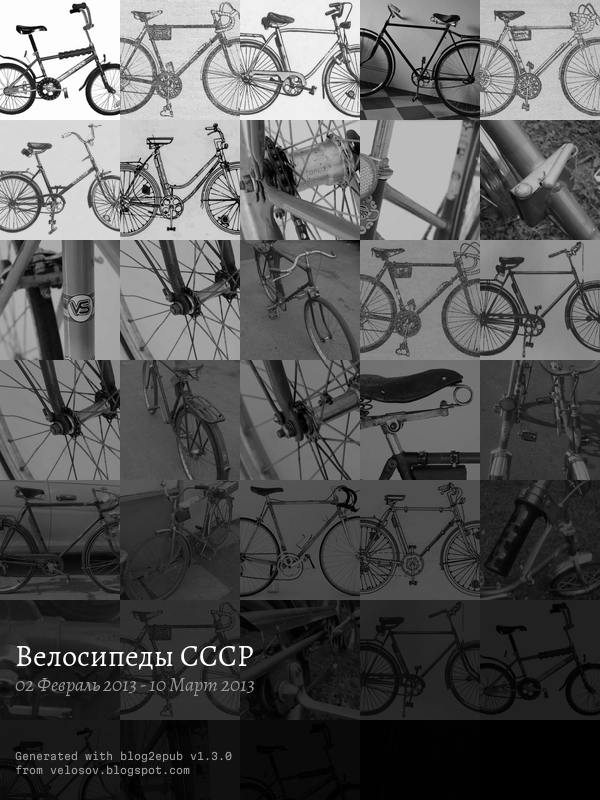
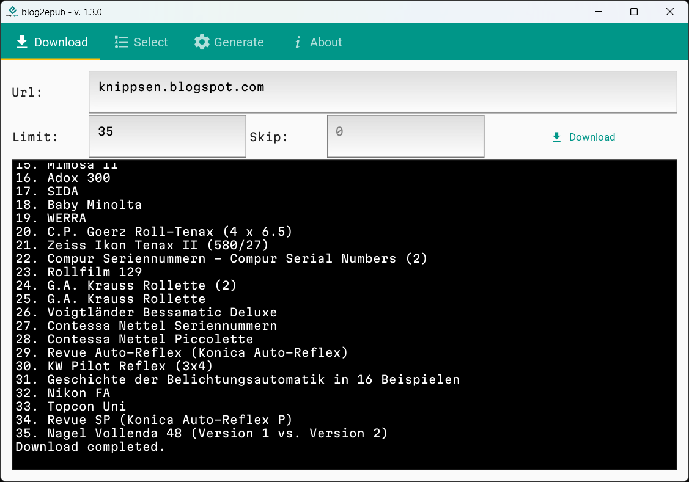

# blog2epub

    

Convert blog to epub using command line or GUI.

### Supported blogs:
- *.blogspot.com
- *.wordpress.com and some blogs based on WordPress

### Main features

- command line (CLI) and graphic user interface (GUI)
- script downloads all text contents of selected blog to epub file,
- if it's possible, it includes post comments,
- images are downsized (to maximum 800/600px) and converted to grayscale,
- one post = one epub chapter,
- chapters are sorted by date ascending,
- cover is generated automatically from downloaded images.

### Example covers

<table style="width:100%;text-align:center;"><tr><td>

</td><td>

</td></tr><tr><td>

</td><td>

</td></tr></table>

## Installation

Checkout for latest available [builds](https://github.com/bohdanbobrowski/blog2epub/releases).

### Running from sources

    git clone git@github.com:bohdanbobrowski/blog2epub.git
    cd blog2epub
    poetry install
    poetry run blog2epubgui

### Building own executable

#### Windows

    poetry run build_gui_windows

#### macOS

Due to a bug - I haven't found out exactly what it is yet - probably in the pyinstaller, all the indicated files are
not copied to the app - so you also need to execute a bash script. This script also creates a dmg image.

    poetry run build_gui_macos
    ./build_macos.sh

## Screenshots of GUI

### Windows (11)

### Linux (Manjaro Gnome)

### macOS (Sonoma 14.4.1)

## CLI

    poetry run blog2epub [blog url] <parameters>

### Parameters

    -l/--limit=[x] - limit epub file to x posts
    -s/--skip=[x] - skip x latest posts
    -q/--images-quality=[0-100] - included images quality (default is 40)
    -n/--no-images - don't include images

## Examples

    poetry run blog2epub starybezpiek.blogspot.com
    poetry run blog2epub velosov.blogspot.com -l=10
    poetry run blog2epub poznanskiehistorie.blogspot.com -q=100
    poetry run blog2epub classicameras.blogspot.com --limit=10 --no-images

## Current version

### [v1.3.0](https://github.com/bohdanbobrowski/blog2epub/releases/tag/v1.2.6) - 2024-07-20
- [X] introduce KivyMD
- [X] python poetry instead of venv
- [X] code refactor and cleanup
- [X] add tabbed layout with list of articles
- [X] 2 stages: crawl/download & ebook generation
- [X] selectable list of articles
- [X] feature: prevent epub file overwriting
- [X] feature: cancel download
- [X] fixed bug: chapters were not added to ebook spine, which caused problems with navigation
- [X] Windows and macOS builds

[&raquo; Complete Change Log here &laquo;](https://github.com/bohdanbobrowski/blog2epub/blob/master/CHANGELOG.md)

## Project backlog

And finally, a list of ideas for known bugs and future plans: [BACKLOG.md](https://github.com/bohdanbobrowski/blog2epub/blob/master/BACKLOG.md)