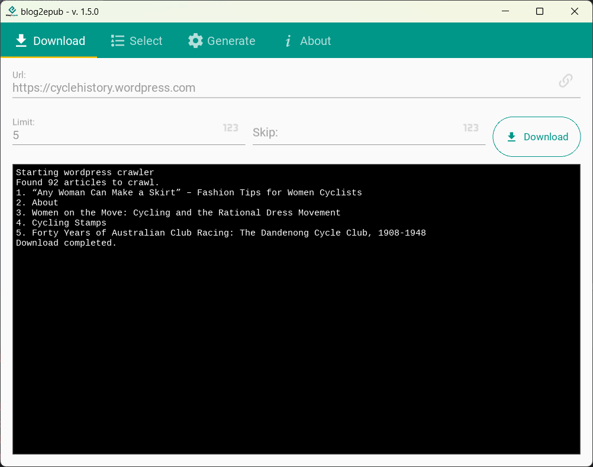

# blog2epub

    

Convert blog to epub using command line or GUI.

> My main goal in creating this app is to preserve the legacy of the blogosphere for future generations.

### Supported blogs:
- *.blogspot.com
- *.wordpress.com
- multiple other blogs and even some webpages

### Main features

- command line (CLI) and graphic user interface (GUI)
- script downloads all text contents of selected blog to epub file,
- if it's possible, it includes post comments,
- images are downsized (to maximum 800/600px) and converted to grayscale,
- one post = one epub chapter,
- chapters are sorted by date ascending,
- cover is generated automatically from downloaded images.

### Example covers

<table style="width:100%;text-align:center;"><tr><td>

</td><td>

</td></tr><tr><td>

</td><td>

</td></tr></table>

## Installation

Checkout for latest available [builds](https://github.com/bohdanbobrowski/blog2epub/releases).

### Running from sources

    git clone git@github.com:bohdanbobrowski/blog2epub.git
    cd blog2epub
    poetry install
    poetry run blog2epubgui

### Building own executable

#### Windows

    poetry run build_gui_windows

#### macOS

    poetry run build_gui_macos

And then to create dmg image with app:

    ./make_macos_dmg.sh

#### Android

Before you start, you'll need to install buildozer following this [installation documentation](https://buildozer.readthedocs.io/en/latest/installation.html).

    poetry shell
    buildozer -v android

## Screenshots of GUI

### Android (Google Pixel 6a)

### Windows (11)

### Linux (Manjaro Gnome)

### macOS (Sonoma 14.4.1)

## CLI

    blog2epub --help
    usage: Blog2epub Cli interface [-h] [-l LIMIT] [-s SKIP] [-q QUALITY] [-o OUTPUT] [-d] url
    
    Convert blog (blogspot.com, wordpress.com or another based on Wordpress) to epub using CLI or GUI.
    
    positional arguments:
      url                   url of blog to download
    
    options:
      -h, --help            show this help message and exit
      -l LIMIT, --limit LIMIT
                            articles limit
      -s SKIP, --skip SKIP  number of skipped articles
      -q QUALITY, --quality QUALITY
                            images quality (0-100)
      -o OUTPUT, --output OUTPUT
                            output epub file name
      -d, --debug           turn on debug

Example:

    blog2epub starybezpiek.blogspot.com -l=2 -o=example.epub
    Starting blogger.com crawler
    Found 54 articles to crawl.
    Downloading.
    1. 10 lat kremlowskiej propagandy, czyli RT ujawnia swoje sekrety
    Downloading.
    2. "Komunę obaliliśmy, a nadal jest źle. Dlaczego?" Czyli 1984 Orwella właściwie odczytany
    Locale set as en_US.UTF-8
    Generating cover (800px*600px) from 1 images.
    Cover generated: .\starybezpiek.blogspot.com\example.epub.jpg
    Epub created: .\example.epub

## Examples

    poetry run blog2epub starybezpiek.blogspot.com
    poetry run blog2epub velosov.blogspot.com -l=10
    poetry run blog2epub poznanskiehistorie.blogspot.com -q=100
    poetry run blog2epub classicameras.blogspot.com --limit=10 --no-images

## Running tests

    pytest ./tests
    pytest --cov=blog2epub ./tests
    pytest --cov=blog2epub --cov-report=html ./tests

## Current version

### [v1.5.0 - Release Candidate 1](https://github.com/bohdanbobrowski/blog2epub/releases/tag/v1.5.0_RC1)
- [X] integration testing
- [X] increase unit test coverage
- [X] use sitemaps.xml for scraping
- [X] crawlers refactor
  - [X] use data models
  - [X] more common methods in crawler class
  - [X] expand crawler abstract
- [X] cli interface refactor
- [X] greek alphabet support
- [X] image download and attachment bug solved (ex. modernistyczny-poznan.blogspot.com)
- [X] improved resistance to http errors
- [X] dedicated crawler class for zeissikonveb.de
- [X] (on GUI) skip value is enlarged on limit value (if such is set)
- [X] download progress is much more verbose, also on GUI it can be cancelled everytime

[&raquo; Complete Change Log here &laquo;](https://github.com/bohdanbobrowski/blog2epub/blob/master/CHANGELOG.md)

## Project backlog

And finally, a list known bugs and future plans for some new functions and enhancements: [BACKLOG.md](https://github.com/bohdanbobrowski/blog2epub/blob/master/BACKLOG.md)

## Project road map:

- 1.0 - somewhat working
- 2.0 - fully working project, 90% unit tested and available builds for Android/Windows/Linux/MacOS
